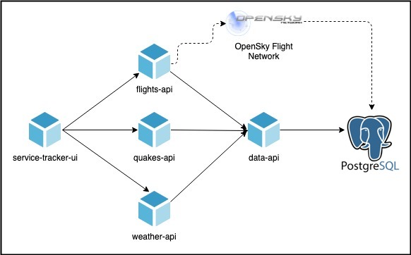

# OAM Tutorial

This tutorial uses OAM with ARM-DSL to deploy an example microservices application with a Javascript Web UI, a Postgres database, and a set of REST API microservices.

The application being deployed is shown in the following diagram:



> Full application original source here:
> https://github.com/chzbrgr71/service-tracker

## Getting started

Complete the getting started section [here](../README.md#getting-started). 

After completing the getting started section you should have two terminal windows open:

- A terminal connected via `ssh` to a "control plane" Azure VM running minikube
- A terminal on your local machine where you can use `kubectl` to communicate with an AKS cluster

The control plane VM is where you will perform commands to deploy and manage application using OAM.

The AKS cluster is where the application containers will run, and the actual application will be hosted.

### Clone this repository

Clone this repository locally using whatever technique you prefer. Example:

```sh
git clone git@github.com/azure/azure-oam-solution.git
```

This repository contains code you will use during the tutorial as well as a solution you can use to check your work. You might find it convenient to use the `./tutorial/flight-tracker` directory as your working directory for the bulk of the tutorial.

## Deploying your first application

The goal for this step is to use the ARM-DSL language to run a single container in Kubernetes and accept HTTP traffic from the internet.

For this step you'll understand the following concepts of OAM:

- `Component`: describes an individual container or other workload
- `ApplicationConfiguration`: describes the deployment of a group of components

---

Here's the basic `Component` for this step - the contents are printed here with comments for explanation purposes - you can find this example saved at `./hello-world/component.arm`. For now focus on reading and understanding these examples, we'll deploy them in a minute.

The container used in this example is a "Hello, world!" type webserver sample from nginx.

```js
// Resource statement declare an object - every type of OAM definition in ARM-DSL will be inside a resource statement.
// The string 'Component@core.oam.dev/v1alpha2' specifies the kind of resource and its version.
resource oam 'Component@core.oam.dev/v1alpha2' _ {

  // The metadata section must specify a name for the object. 
  metadata: {
    name: 'hello-world'
  }
  
  // The spec section describes the properties of the component.
  spec : {

    // The workload section allows the description of different types of workloads.
    //
    // Right now the only supported workload is 'ContainerizedWorkload' - which is intended
    // for long-running server type containers.
    //
    // Workloads each have kind and apiVersion as well as a name. For now just remember that the
    // name should be the the same as the component name.
    workload: {
      apiVersion: 'core.oam.dev/v1alpha2'
      kind: 'ContainerizedWorkload'
      metadata: {
        name: 'hello-world'
      }

      // The spec section (inside the workload) contains the properties that configure the container.
      spec: {

        // Our workloads are all running on linux-amd64 but other platforms can be supported.
        osType: 'linux'
        arch: 'amd64'

        // A list of containers to run and their relevant settings. This should be familiar
        // if you've ever used docker-compose or Kubernetes.
        containers: [
          {
            name: 'hello-world'
            image: 'nginxdemos/hello'
            ports: [
              {
                name: 'http'
                containerPort: 80
                protocol: 'TCP'
              }
            ]
          }
        ]
      }
    }
  }
}
```

ARM-DSL is a JSON-like language intended for tersely specifying objects. Arrays are defined with `[]`, objects are defined with `{}`, strings are *single-quoted* (`'this is a string'`).

Defining a `Component` is like specifying a *template for a container* - nothing runs as a result of defining a `Component`. What's needed to deploy the application is to define an `ApplicationConfiguration`. 

The `ApplicationConfiguration` used in this step has its contents displayed here for learning purposes. You can find it on disk at `./hello-world/applicationconfiguration.arm`.

```js
// Like a Component, the ApplicationConfiguration also uses a resource statement to declare an object.
resource oam 'ApplicationConfiguration@core.oam.dev/v1alpha2' _ {

  // Like a Component, the ApplicationConfiguration also must declare a metadata section and a name.
  metadata: {
    name: 'hello-world'
  }

  // The spec section contains the details of the ApplicationConfiguration. 
  // The primary thing that it should contain is a list of Components.
  spec : {
    components: [
      {
        // Refers to the name of the Component declared above.
        componentName: 'hello-world'
      }
    ]
  }
}
```

Applying an `ApplicationConfiguration` as well as all of the `Component` definitions it contains will deploy the application to Kubernetes.

---

Now it's time to deploy this example. Make sure you have an active terminal for both the control plane VM (running minikube) and the AKS cluster. You will use the control plane VM to deploy manifests and the applications will run in the AKS cluster.

Your control plane virtual machine wil already have `azoam` and `kubectl` on the path so they can be run. 

Using the control plane vm:

```sh
# you should be logged in to the control plane VM as 'azureuser'
whoami

# this command will print information about the configured kubernetes cluster
# minikube should be running - use `minikube start` if it is not
kubectl cluster-info

# deploy the application
azoam hello-world/* | kubectl apply -f -
```

You should see output like the following, this means that the Kubernetes objects were created in the control plane.

```txt
applicationconfiguration.core.oam.dev/hello-world created
component.core.oam.dev/hello-world created
```

> :bulb: What's actually happening in this example is that `azoam` is translating the ARM-DSL definitions into Kubernetes style YAML definitions and applying them to the local minikube cluster. If you want to see what it looks like you can use `azoam hello-world/*` and see the YAML that's output. Right now the OAM control plane is running inside the AKS cluster.

As a next step - verify that the control plane has successfully deployed the application to AKS:

```sh
kubectl describe applicationconfiguration
```

You'll see lots of output - with the final lines looking like:

```txt
 Warning  CannotRenderComponents  99s               oam/applicationconfiguration.core.oam.dev  cannot get component "hello-world": Component.core.oam.dev "hello-world" not found
  Normal   RenderedComponents      9s (x4 over 99s)  oam/applicationconfiguration.core.oam.dev  Successfully rendered components
  Normal   AppliedComponents       9s (x4 over 99s)  oam/applicationconfiguration.core.oam.dev  Successfully applied components
```

The last line indicates that the components have been deployed to the remote AKS cluster. If you make a mistake, for instance omitting a required property, it will be displayed here.

Now you can use your other terminal (AKS cluster) to verify that the application was deployed:

```sh
# You should see your normal username here (not 'azureuser')
whoami 

# You should see a cluster ending with '.azmk8s.io'
# This should be the AKS cluster created by the Getting Started instructions 
kubectl cluster-info

kubectl get pods
```

You should see output like the following, this indicates that the application is running. 

```txt
NAME                          READY   STATUS    RESTARTS   AGE
hello-world-548c548c8-nflnx   1/1     Running   0          6m20s
```

Next, let's look for a public IP address. Right now OAM will create a public endpoint for every Kubernetes service it creates.

```sh
kubectl get svc
```

If you see output like the following (`EXTERNAL-IP`), then your service has a public IP address assigned.

```txt
NAME          TYPE           CLUSTER-IP     EXTERNAL-IP     PORT(S)        AGE
hello-world   LoadBalancer   10.0.195.163   52.247.202.29   80:31783/TCP   7m6s
kubernetes    ClusterIP      10.0.0.1       <none>          443/TCP        2d
```

If the IP address is still in the pending state wait a few seconds and try again until the `EXTERNAL-IP` is populated.

Now paste the IP address into your browser (your IP address will be different from the one shown here). After a few seconds you should see some basic info about the server.

If this is working then you've successfully completed this step. You can now remove this application and move on the next step.

```sh
# using the control plane VM
azoam hello-world/* | kubectl delete -f -
```

## Deploying Flight-Tracker

Now you're ready to work with the flight tracker application, and write some of your own OAM definitions.

The application being deployed is shown in the following diagram:


---

For this example we'll be running the PostgreSQL database in the cluster as a `ContainerizedWorkload`. This means that you'll need a total of 6 `Component` definitions and a single `ApplicationConfiguration`.

You can find some starter manifests in `./flight-tracker` - the `quakes-api` service and database are done for you to introduce more of the concepts. You can divide all of these assets into individual files however you like. The tools don't enforce any restrictions. It's most convenient to place all of the files in a single directory so they can be applied using a directory wildcard.

You can also find the completed sample in `./flight-tracker-solution` for reference if you want to check your answers.

### 1. Create an empty ApplicationConfiguration

Create an `ApplicationConfiguration` declaration with the name `flight-tracker`. Remember that an `ApplicationConfiguration` should use the resource type `ApplicationConfiguration@core.oam.dev/v1alpha2`. Feel free to refer to the previous example `./hello-world/applicationconfiguration.arm` as a template.

For now the `spec.components` node should be an empty array.

### 2. Using the db Component

The database in this example is run as a normal `ContainerizedWorkload`. You can find the complete code in `./flight-tracker/db.arm`. This step will require you to understand the new features used by this component, and include it in your `ApplicationConfiguration`.

Here are the contents of the `db` `Component` with some annotations to introduce the parameter concept. Most of this definition should look familiar from the examples with the hello-world application.

```js
// input statements declare parameters that can be set by the ApplicationConfiguration
//
// Use parameters to avoid hardcoding of environment-specific configuration. In this
// the database username, database name, and database password will be passed in. Since
// we're running the database in a container, these values will be used to configure
// the database itself. Components that need to connect to the database will need the
// same values to make a connection.
//
// Most parameters will be of type `string`. Use `securestring` when the contents are
// sensitive.
input string dbuser
input string dbname
input securestring dbpassword

resource oam 'Component@core.oam.dev/v1alpha2' _ {
  metadata: {
    name: 'db'
  }
  spec : {
    workload: {
      apiVersion: 'core.oam.dev/v1alpha2'
      kind: 'ContainerizedWorkload'
      metadata: {
        name: 'db'
      }
      spec: {
        osType: 'linux'
        arch: 'amd64'
        containers: [
          {
            name: 'postgres'
            image: 'docker.io/postgres:9.6.17-alpine'

            // The `env` property specifies values for environment variables of the container.
            // It's typical to use `env` with parameters to pass data from the ApplicationConfiguration
            // into the container.
            //
            // The `env` property contains an array of objects with the `name` and `value` properties set.
            env: [
              {
                // Referencing the value of a parameter doesn't require a special syntax, just use the parameter name.
                name: 'POSTGRES_USER'
                value: dbuser
              }
              {
                name: 'POSTGRES_PASSWORD'
                value: dbpassword
              }
              {
                name: 'POSTGRES_DB'
                value: dbname
              }
            ]
            ports: [
              {
                name: 'postgres'
                containerPort: 5432
                protocol: 'TCP'
              }
            ]
          }
        ]
      }
    }
  }
}
```

The `db` `Component` is already defined for you in `./flight-tracker/db.arm`.

Now lets's include it in the (currently empty `ApplicationConfiguration`) you created in the previous step. It should look like the following:

```js
resource oam 'ApplicationConfiguration@core.oam.dev/v1alpha2' _ {
  metadata: {
    name: 'flight-tracker'
  }
  spec : {
    components: [
      {
        componentName: 'db'
      }
    ]
  }
}
```

However that's not quite enough - because we need to satisfy the parameters of the component by providing parameter values. A component listed in `spec.components` can also contain a `parameterValues` property that specifies the values.

Putting it together with some values it should look like this:

```js
resource oam 'ApplicationConfiguration@core.oam.dev/v1alpha2' _ {
  metadata: {
    name: 'flight-tracker'
  }
  spec : {
    components: [
      {
        componentName: 'db'
        parameterValues: [
          {
            name: 'dbuser'
            value: 'myuser'
          }
          {
            name: 'dbpassword'
            value: 'mypassword'
          }
          {
            name: 'dbname'
            value: 'hackfest'
          }
        ]
      }
    ]
  }
}  
```

Save this change to your `ApplicationConfiguration`.

Now you've learned how to declare parameters for a `Component` and to satisfy them in an `ApplicationConfiguration`. You'll need to use this for the rest of the `Components` you write for this tutorial.

### 3. Create the data-api Component 

The next component to create is the `data-api` `Component`. This is a REST API that will communicate with the `db` `Component` that was just created, and it needs access to the database credentials.

You should be familiar by now with the basic structure of `Component` that's using `ContainerizedWorkload` to run a container.

Here's a template you can re-use to get started:

```js
// parameters (as many as you need)
input // <type> <parameter name>

resource oam 'Component@core.oam.dev/v1alpha2' _ {
  metadata: {
    name: // <name> (string)
  }
  spec : {
    workload: {
      apiVersion: 'core.oam.dev/v1alpha2'
      kind: 'ContainerizedWorkload'
      metadata: {
        name: // <name> (string)
      }
      spec: {
        osType: 'linux'
        arch: 'amd64'
        containers: [
          {
            name: // <name> (string)
            image: // <image> (string)
            env: [
              // Environment variables (as many as you need)
              //
              // `env` entries are an object with `name` and `value` set
              // The value can be a parameter or a single-quoted string
              //
              // {
              //   name: 'POSTGRES_USER'
              //   value: dbuser
              // }
            ]
            ports: [
              // You can define multiple ports for a container, but all of the examples
              // in this sample only need a single port
              {
                name: // <port name> (string)
                containerPort: // <port> (integer)
                protocol: 'TCP'
              }
            ]
          }
        ]
      }
    }
  }
}
```

Try to define the `data-api` component yourself, and you can check your answer against the solution in `./flight-tracker-solution/data-api.arm`.

Some information you need:

- Use the `name` `data-api`
- Use the `image` `artursouza/rudr-data-api:0.50`
- The port name is just a descriptive name - use `'http'`
- The listening port for `data-api` is `3009`
- The `data-api` `Component` needs several environment variables set to match the `db` component:
  - `DATABASE_USER` should use a parameter to pass in the username
  - `DATABASE_PASSWORD` should use a `securestring` parameter to pass in the password
  - `DATABASE_HOSTNAME` should use a parameter to pass in the hostname of the `db` component
  - `DATABASE_PORT` should use a parameter to pass in the listening port of the `db` component
  - `DATABASE_NAME` should use a parameter to pass in the the database name from the `db` component
  - `DATABASE_DRIVER` should use the hardcoded value `'postgres'`
  - `DATABASE_OPTIONS` should use the hardcoded value `''` (empty string)
  - You should end up with 7 environment variables total - 5 based on parameters and 2 hardcoded

When you've completed this, let's add this `Component` and its parameter values to the `ApplicationConfiguration` - remember that each of those parameters needs a value.

The database username, password and name should be the same as what we used for the `db` component parameters, but what about the hostname and port?

- The port that we used for the `db` `Component` is `5432`
- The hostname should be `db` - this will resolve via DNS due to the fact that we're running in Kubernetes

Here's what those definitions might look like (your parameter names might be different):

```js
resource oam 'ApplicationConfiguration@core.oam.dev/v1alpha2' _ {
  metadata: {
    name: 'flight-tracker'
  }
  spec : {
    components: [
      {
        componentName: 'db'
        parameterValues: [
          {
            name: 'dbuser'
            value: 'myuser'
          }
          {
            name: 'dbpassword'
            value: 'mypassword'
          }
          {
            name: 'dbname'
            value: 'hackfest'
          }
        ]
      }
      {
        componentName: 'data-api'
        parameterValues: [
          {
            name: 'dbuser'
            value: 'myuser'
          }
          {
            name: 'dbpassword'
            value: 'mypassword'
          }
          {
            name: 'dbname'
            value: 'hackfest'
          }
          {
            name: 'dbhostname'
            value: 'db'
          }
          {
            name: 'dbport'
            value: '5432'
          }
        ]
      }
    ]
  }
}
```

This doesn't feel great, because we've got duplicated values. It would be easy to change one of these and not the other. We can introduce variables to hold these values so they have a single definition.

Here's the same example using the `variable` statement to define variables:

```js
variable dbuser 'myuser'
variable dbpassword 'mypassword'
variable dbname 'hackfest'

resource oam 'ApplicationConfiguration@core.oam.dev/v1alpha2' _ {
  metadata: {
    name: 'flight-tracker'
  }
  spec : {
    components: [
      {
        componentName: 'db'
        parameterValues: [
          {
            name: 'dbuser'
            value: dbuser
          }
          {
            name: 'dbpassword'
            value: dbpassword
          }
          {
            name: 'dbname'
            value: dbname
          }
        ]
      }
      {
        componentName: 'data-api'
        parameterValues: [
          {
            name: 'dbuser'
            value: dbuser
          }
          {
            name: 'dbpassword'
            value: dbpassword
          }
          {
            name: 'dbname'
            value: dbname
          }
          {
            name: 'dbhostname'
            value: 'db'
          }
          {
            name: 'dbport'
            value: '5432'
          }
        ]
      }
    ]
  }
}
```

Save these changes to the `ApplicationConfiguration` and we're ready to move on to the next step.

### 4. Create the flights Component

The next component to create is the `flights` `Component`. This is a REST API that will communicate with the `data-api` `Component` that was just created, and it needs access to URI of the `data-api` `Component`.

Try defining this one on your own. You might want to reuse the template from step 3 to get started. 

Some information you will need:

- Use the `name` `flights`
- Use the `image` `sonofjorel/rudr-flights-api:0.49`
- Use the listening port `3003`
- Create an environment variable called `DATA_SERVICE_URI` and set its value using a parameter

When you're satisfied, add it to the `ApplicationConfiguration`. Use the value `http://data-api:3009` for the URI of the `data-api`. You might want to use a variable.

### 5. Create the quakes Component

The next component to create is the `quakes` `Component`. This is a REST API that will communicate with the `data-api` `Component` that was just created, and it needs access to URI of the `data-api` `Component`.

Try defining this one on your own. You might want to reuse the template from step 3 to get started. 

Some information you will need:

- Use the `name` `quakes`
- Use the `image` `sonofjorel/rudr-quakes-api:0.49`
- Use the listening port `3012`
- Create an environment variable called `DATA_SERVICE_URI` and set its value using a parameter

When you're satisfied, add it to the `ApplicationConfiguration`. You should already know the value to use for the URI of `data-api`.

### 5. Create the weather Component

The next component to create is the `weather` `Component`. This is a REST API that will communicate with the `data-api` `Component` that was just created, and it needs access to URI of the `data-api` `Component`.

Try defining this one on your own. You might want to reuse the template from step 3 to get started. 

Some information you will need:

- Use the `name` `weather`
- Use the `image` `sonofjorel/rudr-weather-api:0.49`
- Use the listening port `3015`
- Create an environment variable called `DATA_SERVICE_URI` and set its value using a parameter

When you're satisfied, add it to the `ApplicationConfiguration`. You should already know the value to use for the URI of `data-api`.

### 6. Create the ui Component

The next component to create is the `ui` `Component`. This is an HTML website that will communicate with the `flights`, `quakes`, and `weather` `Component`s that were just created, and it needs access to their URIs.

Try defining this one on your own. You might want to reuse the template from step 3 to get started. 

Some information you will need:

- Use the `name` `ui`
- Use the `image` `sonofjorel/rudr-web-ui:0.49`
- Use the listening port `8080`
- Create the following environment variables:
  - `FLIGHT_API_ROOT` using a parameter to set the URI of `flights`
  - `QUAKES_API_ROOT` using a parameter to set the URI of `quakes`
  - `WEATHER_API_ROOT` using a parameter to set the URI of `weather`

When you're satisfied, add it to the `ApplicationConfiguration`. Use the following values for URIs of the other components:

- `flights` -> `'http://flights:3003'`
- `quakes` -> `'http://quakes:3012'`
- `weather` -> `'http://weather:3015'`

### 7. Deploy the application

You may want to take a minute to check your work against the solution in `./flight-tracker-solution`.

If you're satisfied go ahead and deploy - remember to use the terminal that you used to connect to the control plane VM.

```sh
# you should be logged in as 'azureuser' in the control plane VM
whoami

# substitute the path to where your files are in this comment
azoam ./flight-tracker/* | kubectl apply -f -
```

You should see output like the following:

```txt
applicationconfiguration.core.oam.dev/flight-tracker created
component.core.oam.dev/data-api created
component.core.oam.dev/db created
component.core.oam.dev/flights created
component.core.oam.dev/quakes created
component.core.oam.dev/ui created
component.core.oam.dev/weather created
```

Next check that the `ApplicationConfiguration` was deployed without errors by running:

```sh
kubectl describe applicationconfiguration
```

You should see a line like the following indicating success:

```txt
  Type    Reason              Age                     From                                       Message
  ----    ------              ----                    ----                                       -------
  Normal  RenderedComponents  4m44s (x125 over 125m)  oam/applicationconfiguration.core.oam.dev  Successfully rendered components
```

Next, switch to your local terminal connected to the AKS cluster - we should be able to see all of the application's pods running:

```sh
kubectl get pods
```

```txt
NAME                        READY   STATUS    RESTARTS   AGE
data-api-6b489fb85f-v8l2j   1/1     Running   6          8m7s
db-57655f887d-rwvnm         1/1     Running   0          8m9s
flights-f5bcb9f69-sfzrg     1/1     Running   0          8m5s
quakes-77fd856676-wmkhh     1/1     Running   0          8m13s
ui-6cddfb8bdc-bphhm         1/1     Running   0          8m10s
weather-6597bdd47f-d8p6h    1/1     Running   0          8m15s
```

You may see the `data-api` pod in a crash loop. This can happen if the database hasn't completed initialization yet. It may need a few minutes to stabilize.

If you get this far then the application has been successfully deployed. You can use the following command from your control plane VM to remove the application.

```sh
# you should be logged in as 'azureuser' in the control plane VM
whoami

# substitute the path to where your files are in this comment
azoam ./flight-tracker/* | kubectl delete -f -
```

## Troubleshooting

Remember that you can find the completed sample in `./flight-tracker-solution` for reference if you want to check your answers.

The best way see errors is using the control plane VM. Usually if you make a mistake (omitting a required property, or setting an invalid value) then the application will fail to deploy on the AKS cluster.

You can see this using:

```sh
kubectl describe applicationconfiguration
```

You'll see lots of output - with the final lines looking like:

```txt
Status:
  Conditions:
    Last Transition Time:  2020-06-27T19:16:55Z
    Message:               cannot apply components: cannot apply workload "": cannot get object: resource name may not be empty
    Reason:                Encountered an error during resource reconciliation
    Status:                False
    Type:                  Synced
Events:
  Type     Reason                  Age               From                                       Message
  ----     ------                  ----              ----                                       -------
  Warning  CannotRenderComponents  21s               oam/applicationconfiguration.core.oam.dev  cannot get component "hello-world": Component.core.oam.dev "hello-world" not found
  Normal   RenderedComponents      3s (x3 over 21s)  oam/applicationconfiguration.core.oam.dev  Successfully rendered components
  Warning  CannotApplyComponents   3s (x3 over 21s)  oam/applicationconfiguration.core.oam.dev  cannot apply workload "": cannot get object: resource name may not be empty
```

In this case the error is: 
```txt
cannot apply workload "": cannot get object: resource name may not be empty
```

---

If you need to fix a mistake the best way to do it is to clear out all of the resources and then apply them again with the correct versions.

```sh
# using the control plane VM
azoam flight-tracker/* | kubectl delete -f -

# after fixing the mistake
azoam flight-tracker/* | kubectl apply -f -
```
